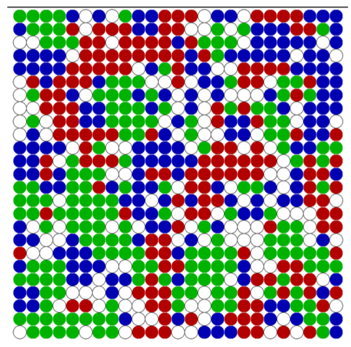
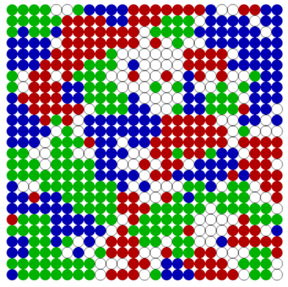
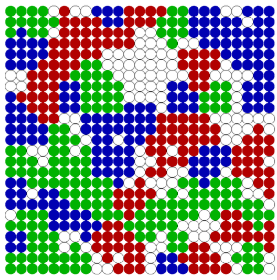

# Schelling Segregation simulated in haskell

The Schelling Segregation model is a very simple model to demonstrate the effect of preferences on segregation. It was conceived by the economist Thomas C. Schelling in 1969, who went on to receive the Nobel Price in economics for his work in 2005.

In this model we assume a discrete 2-dimensional world on a regular NxN cell grid. In this world a given number of agents are randomly placed on cells. Each agent has a color of Red, Green or Blue. It is assigned randomly at the start of the model and will stay the same throughout the whole simulation.

Agents have a happiness measure, which is defined as the ratio of the number of neighbours with same color to the total number of neighbours. As neighbourhood we assume the Moore Neighbourhood (see Figure 1), which are the 8 surrounding cells of an agent. Note that in case of the border of the world, there might be less than 8 neighbours, but we will still use the same measurement of happiness.

(a) t = 0          |  (b) t = 5        |        (c) t = 40
:-------------------------:|:-------------------------:|:-------------------------:
  |   | 

Visualisation of Schelling Segregation. After 40 steps the simulation is stable: all agents are happy and no more movement is happening.

## Demo

